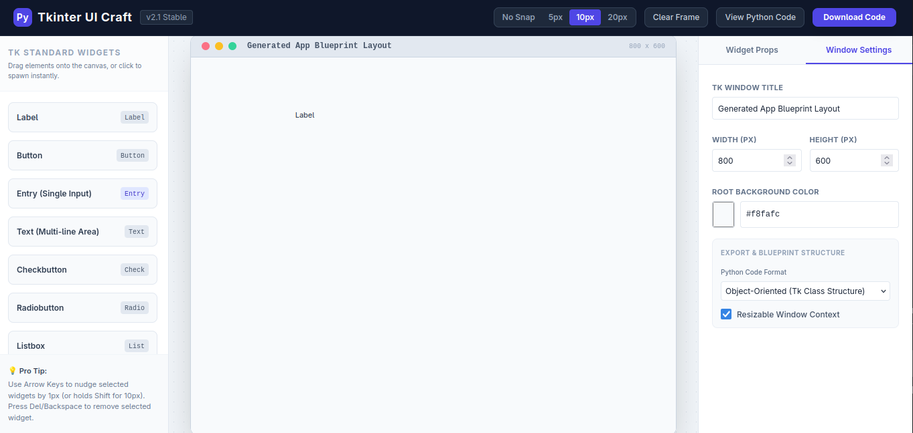

# PyTkinter UI Craft

PyTkinter UI Craft is a modern, web-based drag-and-drop user interface builder for Python's **Tkinter** library. It allows developers and designers to visually create application layouts and instantly export high-quality, ready-to-use Python code.


## 🚀 Features

- **Intuitive Visual Workspace**: Drag widgets from the library and drop them directly onto a simulated OS window frame.
- **Comprehensive Widget Library**: Supports standard Tkinter and TTK widgets:
    - Labels, Buttons, and Frames
    - Entry (Single-line) and Text (Multi-line) inputs
    - Checkbuttons and Radiobuttons
    - Listboxes, Scales (Sliders), and TTK Progressbars
- **Precision Snapping System**: Keep your layout clean with configurable grid snapping (None, 5px, 10px, 20px).
- **Dynamic Property Inspector**: Fine-tune every aspect of your widgets:
    - Positioning (X, Y) and Sizing (Width, Height)
    - Colors (Background & Foreground) with hex code support
    - Typography (Font size and weight)
    - Tkinter-specific attributes (Relief, Border width, Variable names)
- **Window Configuration**: Customize the root window title, dimensions, and background color.
- **Smart Export Engine**: Generate code in two different formats:
    - **Object-Oriented**: Clean, class-based structure for scalable applications.
    - **Functional**: Simple, sequential script format for quick prototypes.
- **Live Code Preview**: Instantly view the generated Python code without leaving the editor.
- **Downloadable Scripts**: Export your design as a `.py` file with one click.

## 🛠️ Keyboard Shortcuts

| Shortcut | Action |
| :--- | :--- |
| **Arrow Keys** | Nudge selected widget by 1px |
| **Shift + Arrow Keys** | Nudge selected widget by 10px |
| **Delete / Backspace** | Remove selected widget |

## 📁 Project Structure

```text
PyTkinter UI Craft
├── Index.html        # Main application entry point
├── css/
│   └── style.css      # Custom styling and widget simulations
└── js/
    ├── script.js      # Core application logic and code generation
    ├── tailwindcdn.js # Tailwind CSS utility framework
```

## 🏁 Getting Started

1. Clone or download this repository.
2. Open `Index.html` in any modern web browser (Chrome, Firefox, Edge, Safari).
3. Start designing your Tkinter interface by dragging widgets from the left sidebar.
4. Click **"View Python Code"** to preview or **"Download Code"** to save your work.

---
*Built with modern web technologies to simplify Python desktop development.*
